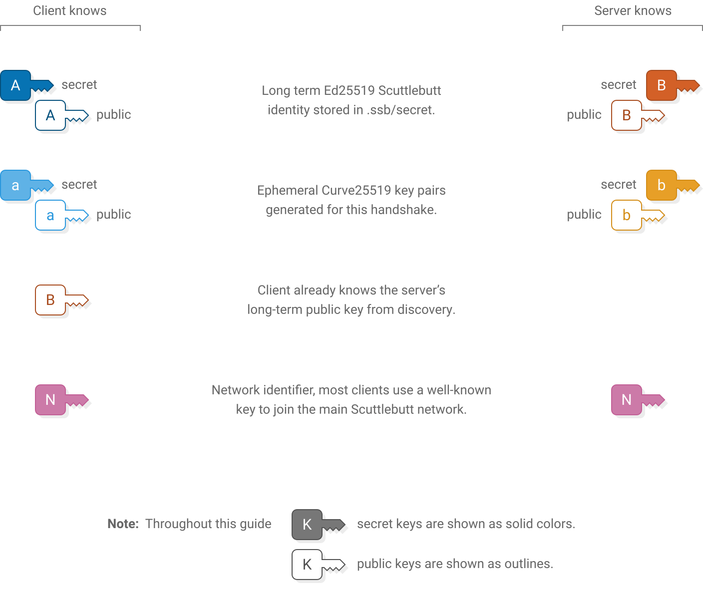
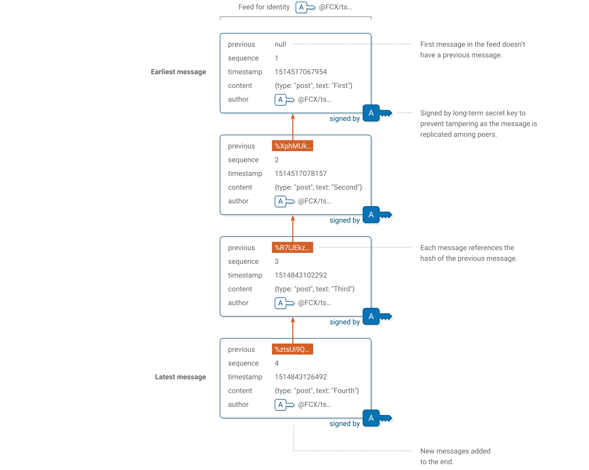

Scuttlebutt Protocol Guide

[ Scuttlebutt Protocol Guide](index.html)

[Repo](https://github.com/ssbc/scuttlebutt-protocol-guide)

Scuttlebutt Protocol Guide
==========================

How Scuttlebutt peers find and talk to each other

* * *

Contents
--------

[Introduction](#introduction)

[Keys and identities](#keys-and-identities)

[Discovery](#discovery)

[Local network](#local-network)

[Invite code](#invite-code)

[Pub message](#pub-message)

[Peer connections](#peer-connections)

[Handshake](#handshake)

[Box stream](#box-stream)

[RPC protocol](#rpc-protocol)

[Feeds](#feeds)

[Structure](#structure)

[Message format](#message-format)

[createHistoryStream](#createHistoryStream)

[Metafeeds](#metafeeds)

[Structure](#bendy-butt)

[Content setion](#metafeed-contentSection)

[Announcing](#metafeed-announcing)

[Use Cases](#metafeed-use-cases)

[Partial Replication](#metafeed-partial-replication)

[Fusion Identity](#metafeed-fusion-identity)

[Network Identity](#metafeed-network-identity)

[Blobs](#blobs)

[Fetching](#fetching)

[Want and have](#want-and-have)

[Following](#following)

[Follow graph](#follow-graph)

[Pubs](#pubs)

[Invites](#invites)

[Rooms](#rooms)

[Tunnel](#rooms-tunnel)

[Joining](#rooms-joining)

[Private messages](#private-messages)

[Encrypting](#encrypting)

[Decrypting](#decrypting)

* * *

[Scuttlebutt](https://www.scuttlebutt.nz/) is a protocol for building decentralized applications that work well offline and that no one person can control. Because there is no central server, Scuttlebutt clients connect to their peers to exchange information. This guide describes the protocols used to communicate within the Scuttlebutt network.

Scuttlebutt is a flexible protocol, capable of supporting many different types of applications. One of its first applications was as a social network. This guide has a slight focus on how to use Scuttlebutt for social networking, but many of the explanations will still be useful if want to use it for something completely different, or are just curious how it works.

Cryptography
------------

### Keys and identities

The first thing a user needs to participate in Scuttlebutt is an identity. An identity is an Ed25519 key pair and typically represents a person, a device, a server or a bot. It’s normal for a person to have several Scuttlebutt identities.

Upon starting for the first time, Scuttlebutt clients will automatically generate an Ed25519 key pair and save it in the user’s home folder under `.ssb/secret`.

Because identities are long and random, no coordination or permission is required to create a new one, which is essential to the network’s design.

Later, a user can choose to give themselves a nickname or avatar to make themselves easier to refer to. Over time nicknames may change but identities stay the same. If a user loses their secret key or has it stolen they will need to generate a new identity and tell people to use their new one instead.

The public key of an identity is presented to users and transmitted in some parts of the network protocol using this format:

Throughout the protocol all instances of base64 are the variant that uses `+` and `/`. The final padding `=` is also required.

The beginning `@` sign signifies that this represents a public key rather than a message or blob, which start with `%` and `&`. Each identity has an associated [feed](#feeds), which is a list of all the messages posted by that identity. This is why the identity is also called a _feed ID_.

### Cryptographic primitives

The Scuttlebutt protocol relies on NaCl/libsodium's cryptobox primitives. This guide uses the following:

`nacl_scalarmult(n, p)`

This is [Libsodium's scalar multiplication function](https://doc.libsodium.org/advanced/scalar_multiplication), which takes two scalars (usually public and/or secret keys). It has the useful property that, given two key pairs `(pk1, sk1)` and `(pk2, sk2)`, `nacl_scalarmult(sk1, pk2) == nacl_scalarmult(sk2, pk1)`, which allows shared secret derivation between peers who know each other's public key. More on this later.

`nacl_auth(msg, key)` and `assert_nacl_auth_verify(authenticator, msg, key)`

This functions are [Libsodium's message authentication function](https://doc.libsodium.org/public-key_cryptography/authenticated_encryption). The former takes a message and returns a 32-bytes authenticator, that acts as a detacted signature of the message. The latter verifies this authenticator is indeed valid for the given message and key; and errors if they don't.

`nacl_secret_box(msg, nonce, key)` and `assert_nacl_secretbox_open(ciphertext, nonce, key)`

These function are based on [Libsodium's crypto\_secretbox\_easy and crypto\_secretbox\_open\_easy function](https://doc.libsodium.org/secret-key_cryptography/secretbox), which use symmetric cryptography to, respectively, encrypt+authenticate, and verify+decrypt a message using a nonce and a shared secret.

`nacl_sign_detached(msg, key)` and `assert_nacl_sign_verify_detached(sig, msg, key)`

The former is computed from [Libsodium's signature functions](https://doc.libsodium.org/public-key_cryptography/public-key_signatures). Unlike the usual Libsodium/NaCl functions, they work with signatures in independent buffers, rather than concatenated with the msg.

`pk_to_curve25519(ed25519_pk)` and `sk_to_curve25519(ed25519_sk)`

These functions convert Ed25519 keys (used for cryptobox) to Curve25519 (aka X25519) keys, used for signing. They are [implemented by Libsodium as `crypto_sign_ed25519_pk_to_curve25519` and `crypto_sign_ed25519_sk_to_curve25519`](https://doc.libsodium.org/advanced/ed25519-curve25519), respectively.

Discovery
---------

After a user has generated their identity they need to find some peers to connect to. To connect to a peer you need its public key and its address using any of the protocol it supports. Typically with TCP/IP, you would need its IP address and port, but the Scuttlebutt protocol is not restricted to TCP/IP as transport. The Scuttlebutt protocol currently has three methods for peers to discover each other.

### Local network

Peers constantly broadcast UDP packets on their local network advertising their presence. The body of each packet is a string containing the peer’s IP address, port and base64-encoded public key (without `@` or `.ed25519`):

##### Implementations

JS

[broadcast-stream](https://github.com/dominictarr/broadcast-stream/blob/master/index.js)

[ssb-local](https://github.com/ssbc/ssb-local/blob/master/index.js)

Java

[LocalDiscoveryService](https://github.com/apache/incubator-tuweni/blob/master/scuttlebutt-discovery/src/main/java/org/apache/tuweni/scuttlebutt/discovery/ScuttlebuttLocalDiscoveryService.java)

Source IP192.168.1.123 Source port8008 Destination IP255.255.255.255 Destination port8008

This message format can be any valid [multiserver address](https://github.com/ssb-js/multiserver#address-format). In local networks, this is usually a `net` address with an IPv4 or IPv6 address.

Current implementations broadcast one of these packets every second. When a peer sees another peer’s broadcast packet they can connect to exchange messages. Some clients show nearby peers in the user interface so that the user can see other people on the same network as them.

UDP source and destination ports are set to the same port number that the peer is listening on TCP for peer connections (normally 8008).

### Invite code

[Invite codes](#invites) help new users get connected to their first [pub](#pubs), which is a Scuttlebutt peer that is publicly accessible over the internet. An invite code contains a pub’s domain name, port and public key.

They also contain a secret key that the user can [redeem](#redeeming-invites) to make the pub [follow](#following) them back. This lets the new user see messages posted by other members of the pub and share their own messages. Invite codes are the most common way for new users to get started on Scuttlebutt.

Pub operators can distribute invite codes any way they see fit, for example by posting them on existing social networks. Some pubs have a web page that anybody can visit to generate an invite code.

### Pub message

Users can post a message to their own [feed](#feeds) advertising a pub:

Here the user `@FCX/ts…` is advertising that they know of pub `@VJM7w1…` along with the pub’s domain name and port.

    {
      "author": "@FCX/tsDLpubCPKKfIrw4gc+SQkHcaD17s7GI6i/ziWY=.ed25519",
      "content": {
        "type": "pub",
        "address": {
          "host": "one.butt.nz",
          "port": 8008,
          "key": "@VJM7w1W19ZsKmG2KnfaoKIM66BRoreEkzaVm/J//wl8=.ed25519"
        }
      },
      …
    }

When others see this message they can make a note that this pub exists and connect to it in the future.

Pub messages are a useful way to find additional peers if you already know a few. Obviously this doesn’t work for new users who don’t know anyone else yet and therefore can’t see any pub messages.

Peer connections
----------------

Once a Scuttlebutt client has discovered the IP address, port number and public key of a peer they can connect via TCP to ask for updates and exchange messages.

### Handshake

The connection begins with a 4-step handshake to authenticate each peer and set up an encrypted channel.

##### Implementations

JS

[protocol.js](https://github.com/auditdrivencrypto/secret-handshake/blob/master/protocol.js)

[crypto.js](https://github.com/auditdrivencrypto/secret-handshake/blob/master/crypto.js)

Py

[crypto.py](https://github.com/pferreir/PySecretHandshake/blob/master/secret_handshake/crypto.py)

Go

[state.go](https://github.com/cryptoscope/secretstream/blob/ad7542b0cbda422a1ea3de7efa62a514672a2c88/secrethandshake/state.go)

[conn.go](https://github.com/cryptoscope/secretstream/blob/ad7542b0cbda422a1ea3de7efa62a514672a2c88/secrethandshake/conn.go)

C

[shs1.c](https://github.com/AljoschaMeyer/shs1-c/blob/master/src/shs1.c)

[sbotc.c](https://git.scuttlebot.io/%25133ulDgs%2FoC1DXjoK04vDFy6DgVBB%2FZok15YJmuhD5Q%3D.sha256/blob/fd953a1e72b4b16e6e5a74bcf2f893dbf1407ce4/sbotc.c)

Java

[HandshakeClient](https://github.com/apache/incubator-tuweni/blob/master/scuttlebutt-handshake/src/main/java/org/apache/tuweni/scuttlebutt/handshake/SecureScuttlebuttHandshakeClient.java)

[HandshakeServer](https://github.com/apache/incubator-tuweni/blob/master/scuttlebutt-handshake/src/main/java/org/apache/tuweni/scuttlebutt/handshake/SecureScuttlebuttHandshakeServer.java)

The handshake uses the [Secret Handshake key exchange](https://dominictarr.github.io/secret-handshake-paper/shs.pdf) which is designed to have these security properties:

*   After a successful handshake the peers have verified each other’s public keys.
*   The handshake produces a shared secret that can be used with a bulk encryption cypher for exchanging further messages.
*   The client must know the server’s public key before connecting. The server learns the client’s public key during the handshake.
*   Once the client has proven their identity the server can decide they don’t want to talk to this client and disconnect without confirming their own identity.
*   A man-in-the-middle cannot learn the public key of either peer.
*   Both peers need to know a key that represents the particular Scuttlebutt network they wish to connect to, however a man-in-the-middle can’t learn this key from the handshake. If the handshake succeeds then both ends have confirmed that they wish to use the same network.
*   Past handshakes cannot be replayed. Attempting to replay a handshake will not allow an attacker to discover or confirm guesses about the participants’ public keys.
*   Handshakes provide forward secrecy. Recording a user’s network traffic and then later stealing their secret key will not allow an attacker to decrypt their past handshakes.

**Client** is the computer initiating the TCP connection and **server** is the computer receiving it. Once the handshake is complete this distinction goes away.

#### Starting keys

Upon starting the handshake, the client and server know these keys:

#### 1\. Client hello

##### Client sends (64 bytes)

##### Server verifies

    concat(
      nacl_auth(
        msg: client_ephemeral_pk,
        key: network_identifier
      ),
      client_ephemeral_pk
    )

    assert(length(msg1) == 64)
    
    client_hmac = first_32_bytes(msg1)
    client_ephemeral_pk = last_32_bytes(msg1)
    
    assert_nacl_auth_verify(
      authenticator: client_hmac,
      msg: client_ephemeral_pk,
      key: network_identifier
    )

First the client sends their  generated ephemeral key. Also included is an hmac that indicates the client wishes to use their key with this specific instance of the Scuttlebutt network.

The  network identifier is a fixed key. On the main Scuttlebutt network it is the following 32-byte sequence:

d4a1cb88a66f02f8db635ce26441cc5d ac1b08420ceaac230839b755845a9ffb

Changing the key allows separate networks to be created, for example private networks or testnets. An eavesdropper cannot extract the network identifier directly from what is sent over the wire, although they could confirm a guess that it is the main Scuttlebutt network because that identifier is publicly known.

The server stores the client’s ephemeral public key and uses the hmac to verify that the client is using the same network identifier.

**hmac** is a function that allows verifying that a message came from someone who knows the same secret key as you. In this case the network identifier is used as the secret key.

Both the message creator and verifier have to know the same message and secret key for the verification to succeed, but the secret key is not revealed to an eavesdropper.

Throughout the protocol, all instances of hmac use HMAC-SHA-512-256 (which is the first 256 bits of HMAC-SHA-512).

#### 2\. Server hello

##### Client verifies

##### Server sends (64 bytes)

    assert(length(msg2) == 64)
    
    server_hmac = first_32_bytes(msg2)
    server_ephemeral_pk = last_32_bytes(msg2)
    
    assert_nacl_auth_verify(
      authenticator: server_hmac,
      msg: server_ephemeral_pk,
      key: network_identifier
    )

    concat(
      nacl_auth(
        msg: server_ephemeral_pk,
        key: network_identifier
      ),
      server_ephemeral_pk
    )

The server responds with their own  ephemeral public key and hmac. The client stores the key and verifies that they are also using the same network identifier.

#### Shared secret derivation

##### Client computes

##### Server computes

    shared_secret_ab = nacl_scalarmult(
      client_ephemeral_sk,
      server_ephemeral_pk
    )
    
    shared_secret_aB = nacl_scalarmult(
      client_ephemeral_sk,
      pk_to_curve25519(server_longterm_pk)
    )

    shared_secret_ab = nacl_scalarmult(
      server_ephemeral_sk,
      client_ephemeral_pk
    )
    
    shared_secret_aB = nacl_scalarmult(
      sk_to_curve25519(server_longterm_sk),
      client_ephemeral_pk
    )

Now that ephemeral keys have been exchanged, both ends use them to derive a shared secret  using scalar multiplication.

The client and server each combine their own ephemeral secret key with the other’s ephemeral public key to produce the same shared secret on both ends. An eavesdropper doesn’t know either secret key so they can’t generate the shared secret. A man-in-the-middle could swap out the ephemeral keys in Messages 1 and 2 for their own keys, so the shared secret  alone is not enough for the client and server to know that they are talking to each other and not a man-in-the-middle.

Because the client already knows the  server’s long term public key, both ends derive a second secret  that will allow the client to send a message that only the real server can read and not a man-in-the-middle.

**Scalar multiplication** is a function for deriving shared secrets from a pair of secret and public Curve25519 keys.

The order of arguments matters. In the NaCl API the secret key is provided first.

Note that long term keys are Ed25519 and must first be converted to Curve25519.

#### 3\. Client authenticate

##### Client computes

##### Server verifies

    detached_signature_A = nacl_sign_detached(
      msg: concat(
        network_identifier,
        server_longterm_pk,
        sha256(shared_secret_ab)
      ),
      key: client_longterm_sk
    )

    msg3_plaintext = assert_nacl_secretbox_open(
      ciphertext: msg3,
      nonce: 24_bytes_of_zeros,
      key: sha256(
        concat(
          network_identifier,
          shared_secret_ab,
          shared_secret_aB
        )
      )
    )
    
    assert(length(msg3_plaintext) == 96)
    
    detached_signature_A = first_64_bytes(msg3_plaintext)
    client_longterm_pk = last_32_bytes(msg3_plaintext)
    
    assert_nacl_sign_verify_detached(
      sig: detached_signature_A,
      msg: concat(
        network_identifier,
        server_longterm_pk,
        sha256(shared_secret_ab)
      ),
      key: client_longterm_pk
    )

##### Client sends (112 bytes)

    nacl_secret_box(
      msg: concat(
        detached_signature_A,
        client_longterm_pk
      ),
      nonce: 24_bytes_of_zeros,
      key: sha256(
        concat(
          network_identifier,
          shared_secret_ab,
          shared_secret_aB
        )
      )
    )

The client reveals their identity to the server by sending their  long term public key. The client also makes a signature using their  long term secret key. By signing the keys used earlier in the handshake the client proves their identity and confirms that they do indeed wish to be part of this handshake.

The client’s message is enclosed in a secret box to ensure that only the server can read it. Upon receiving it, the server opens the box, stores the client’s long term public key and verifies the signature.

An all-zero nonce is used for the secret box. The secret box construction requires that all secret boxes using a particular key must use different nonces. It’s important to get this detail right because reusing a nonce will allow an attacker to recover the key and encrypt or decrypt any secret boxes using that key. Using a zero nonce is allowed here because this is the only secret box that ever uses the key sha256(concat( , , )).

**Detached signatures** do not contain a copy of the message that was signed, only a tag that allows verifying the signature if you already know the message.

Here it is okay because the server knows all the information needed to reconstruct the message that the client signed.

#### Shared secret derivation

##### Client computes

##### Server computes

    shared_secret_Ab = nacl_scalarmult(
      sk_to_curve25519(client_longterm_sk),
      server_ephemeral_pk
    )

    shared_secret_Ab = nacl_scalarmult(
      server_ephemeral_sk,
      pk_to_curve25519(client_longterm_pk)
    )

Now that the server knows the  client’s long term public key, another shared secret  is derived by both ends. The server uses this shared secret to send a message that only the real client can read and not a man-in-the-middle.

#### 4\. Server accept

##### Client verifies

##### Server computes

    detached_signature_B = assert_nacl_secretbox_open(
      ciphertext: msg4,
      nonce: 24_bytes_of_zeros,
      key: sha256(
        concat(
          network_identifier,
          shared_secret_ab,
          shared_secret_aB,
          shared_secret_Ab
        )
      )
    )
    
    assert_nacl_sign_verify_detached(
      sig: detached_signature_B,
      msg: concat(
        network_identifier,
        detached_signature_A,
        client_longterm_pk,
        sha256(shared_secret_ab)
      ),
      key: server_longterm_pk
    )

    detached_signature_B = nacl_sign_detached(
      msg: concat(
        network_identifier,
        detached_signature_A,
        client_longterm_pk,
        sha256(shared_secret_ab)
      ),
      key: server_longterm_sk
    )

##### Server sends (80 bytes)

    nacl_secret_box(
      msg: detached_signature_B,
      nonce: 24_bytes_of_zeros,
      key: sha256(
        concat(
          network_identifier,
          shared_secret_ab,
          shared_secret_aB,
          shared_secret_Ab
        )
      )
    )

The server accepts the handshake by signing a message using their  long term secret key. It includes a copy of the client’s previous signature. The server’s signature is enclosed in a secret box using all of the shared secrets.

Upon receiving it, the client opens the box and verifies the server’s signature.

Similarly to the previous message, this secret box also uses an all-zero nonce because it is the only secret box that ever uses the key sha256(concat( , , , )).

#### Handshake complete

At this point the handshake has succeeded. The client and server have proven their identities to each other.

The shared secrets established during the handshake are used to set up a pair of box streams for securely exchanging further messages.

### Box stream

Box stream is the bulk encryption protocol used to exchange messages following the handshake until the connection ends. It is designed to protect messages from being read or modified by a man-in-the-middle.

Each message in a box stream has a header and body. The header is always 34 bytes long and says how long the body will be.

#### Sending

Sending a message involves encrypting the body of the message and preparing a header for it. Two secret boxes are used; one to protect the header and another to protect the body.

##### Implementations

JS

[pull-box-stream](https://github.com/dominictarr/pull-box-stream/blob/master/index.js)

Py

[boxstream.py](https://github.com/pferreir/PySecretHandshake/blob/master/secret_handshake/boxstream.py)

Go

[box.go](https://github.com/cryptoscope/secretstream/blob/ad7542b0cbda422a1ea3de7efa62a514672a2c88/boxstream/box.go)

[unbox.go](https://github.com/cryptoscope/secretstream/blob/ad7542b0cbda422a1ea3de7efa62a514672a2c88/boxstream/unbox.go)

C

[box-stream.c](https://github.com/AljoschaMeyer/box-stream-c/blob/master/src/box-stream.c)

[sbotc.c](https://git.scuttlebot.io/%25133ulDgs%2FoC1DXjoK04vDFy6DgVBB%2FZok15YJmuhD5Q%3D.sha256/blob/fd953a1e72b4b16e6e5a74bcf2f893dbf1407ce4/sbotc.c)

Java

[Stream](https://github.com/apache/incubator-tuweni/blob/master/scuttlebutt-handshake/src/main/java/org/apache/tuweni/scuttlebutt/handshake/SecureScuttlebuttStream.java)

#### Receiving

Receiving a message involves reading the header to find out how long the body is then reassembling and opening the body secret box.

#### Goodbye

The stream ends with a special “goodbye” header. Because the goodbye header is authenticated it allows a receiver to tell the difference between the connection genuinely being finished and a man-in-the-middle forcibly resetting the underlying TCP connection.

When a receiver opens a header and finds that it contains all zeros then they will know that the connection is finished.

#### Keys and nonces

Two box streams are used at the same time when Scuttlebutt peers communicate. One is for client-to-server messages and the other is for server-to-client messages. The two streams use different keys and starting nonces for their secret boxes.

The starting nonce is used for the first header in the stream (“secret box 1” in the above figures), then incremented for the first body (“secret box 2”), then incremented for the next header and so on.

### RPC protocol

##### Implementations

JS

[packet-stream-codec](https://github.com/ssbc/packet-stream-codec/blob/master/index.js)

Py

[packet\_stream.py](https://github.com/pferreir/pyssb/blob/master/ssb/packet_stream.py)

[muxrpc.py](https://github.com/pferreir/pyssb/blob/master/ssb/muxrpc.py)

Go

[codec](https://github.com/cryptoscope/go-muxrpc/tree/601b7be81ee6b2bd6f32b1247e4688537f696794/codec)

[rpc.go](https://github.com/cryptoscope/go-muxrpc/blob/601b7be81ee6b2bd6f32b1247e4688537f696794/rpc.go)

C

[sbotc.c](https://git.scuttlebot.io/%25133ulDgs%2FoC1DXjoK04vDFy6DgVBB%2FZok15YJmuhD5Q%3D.sha256/blob/fd953a1e72b4b16e6e5a74bcf2f893dbf1407ce4/sbotc.c)

Java

[RPCCodec](https://github.com/apache/incubator-tuweni/blob/master/scuttlebutt-rpc/src/main/java/org/apache/tuweni/scuttlebutt/rpc/RPCCodec.java)

Scuttlebutt peers make requests to each other using an RPC protocol. Typical requests include asking for the latest messages in a particular feed or requesting a blob.

The RPC protocol can interleave multiple requests so that a slow request doesn’t block following ones. It also handles long-running asynchronous requests for notifying when an event occurs and streams that deliver multiple responses over time.

Similar to the box stream protocol, the RPC protocol consists of 9-bytes headers followed by variable-length bodies. There is also a 9-bytes goodbye message which is just a zeroed out header.

**Remote procedure calls** are where a computer exposes a set of procedures that another computer can call over the network.

The requester tells the responder the name of the procedure they wish to call along with any arguments. The responder performs the action and returns a value back to the requester.

Both peers make requests to each other at the same time using the pair of box streams that have been established. The box streams protect the RPC protocol from eavesdropping and tampering.

RPC messages are not necessarily aligned to box stream boxes.

Multiple RPC messages may be put inside one box or a single RPC message may be split over several boxes.

#### Header structure

RPC headers contain a set of flags to say what type of message it is, a field specifying its length and a request number which allows matching requests with their responses when there are several active at the same time.

#### Request format

To make an RPC request, send a JSON message containing the name of the procedure you wish to call, the type of procedure and any arguments.

The name is a list of strings. For a top-level procedure like _createHistoryStream_ the list only has one element: `["createHistoryStream"]`. Procedures relating to blobs are grouped in the blobs namespace, for example to use _blobs.get_ send the list: `["blobs", "get"]`.

There are three types of procedure used when Scuttlebutt peers talk to each other:

*   _Source_ procedures return multiple responses over time and are used for streaming data or continually notifying when new events occur. When making one of these requests, the stream flag in the RPC header must be set.
*   _Duplex_ procedures are similar to _source_ procedures but allow _multiple requests_ as well as multiple responses over time. The many request events in a duplex utilize the same request number, and the stream flag must be set.
*   _Async_ procedures return a single response. Async responses can arrive quickly or arrive much later in response to a one-off event.

For each procedure in the RPC protocol you must already know whether it is source or async and correctly specify this in the request body.

The reference Scuttlebot implementation also has other internal procedures and procedure types which are used by graphical user interfaces like Patchwork.

This guide only covers the procedures that are publicly available to other Scuttlebutt peers.

#### Source example

This RPC message shows an example of a _createHistoryStream_ request:

JSON messages don’t have indentation or whitespace when sent over the wire.

Request number1 Body typeJSON StreamYes End/errNo

    {
      "name": ["createHistoryStream"],
      "type": "source",
      "args": [{"id": "@FCX/tsDLpubCPKKfIrw4gc+SQkHcaD17s7GI6i/ziWY=.ed25519"}]
    }

_createHistoryStream_ is how Scuttlebutt peers ask each other for a list of messages posted by a particular feed. It has one argument that is a JSON dictionary specifying more options about the request. _id_ is the only required option and says which feed you are interested in.

Because this is the first RPC request, the request number is 1. The next request made by this peer will be numbered 2. The other peer will also use request number 1 for their first request, but the peers can tell these apart because they know whether they sent or received each request.

Now the responder begins streaming back responses:

Request number\-1 Body typeJSON StreamYes End/errNo

    {
      "key": "%XphMUkWQtomKjXQvFGfsGYpt69sgEY7Y4Vou9cEuJho=.sha256",
      "value": {
        "previous": null,
        "author": "@FCX/tsDLpubCPKKfIrw4gc+SQkHcaD17s7GI6i/ziWY=.ed25519",
        "sequence": 1,
        "timestamp": 1514517067954,
        "hash": "sha256",
        "content": {
          "type": "post",
          "text": "This is the first post!"
        },
        "signature": "QYOR/zU9dxE1aKBaxc3C0DJ4gRyZtlMfPLt+CGJcY73sv5abKK
                      Kxr1SqhOvnm8TY784VHE8kZHCD8RdzFl1tBA==.sig.ed25519"
      },
      "timestamp": 1514517067956
    }

Request number\-1 Body typeJSON StreamYes End/errNo

    {
      "key": "%R7lJEkz27lNijPhYNDzYoPjM0Fp+bFWzwX0SmNJB/ZE=.sha256",
      "value": {
        "previous": "%XphMUkWQtomKjXQvFGfsGYpt69sgEY7Y4Vou9cEuJho=.sha256",
        "author": "@FCX/tsDLpubCPKKfIrw4gc+SQkHcaD17s7GI6i/ziWY=.ed25519",
        "sequence": 2,
        "timestamp": 1514517078157,
        "hash": "sha256",
        "content": {
          "type": "post",
          "text": "Second post!"
        },
        "signature": "z7W1ERg9UYZjNfE72ZwEuJF79khG+eOHWFp6iF+KLuSrw8Lqa6
                      IousK4cCn9T5qFa8E14GVek4cAMmMbjqDnAg==.sig.ed25519"
      },
      "timestamp": 1514517078160
    }

Because the responses are part of a stream, their RPC headers have the stream flag set.

All responses use the same request number as the original request but negative.

Each message posted by the feed is sent back in its own response. This feed only contains two messages.

To close the stream the responder sends an RPC message with both the stream and end/err flags set and a JSON body of `true`. When the requester sees that the stream is being closed they send a final message to close their own end of it (source type requests must always be closed by both ends).

Request number\-1 Body typeJSON StreamYes End/errYes

    true

Request number1 Body typeJSON StreamYes End/errYes

    true

Alternatively, to abort a stream before it is finished the requester can send their closing message early, at which point the responder closes their own end.

Request number1 Body typeJSON StreamYes End/errYes

    true

 

Request number\-1 Body typeJSON StreamYes End/errYes

    true

#### Async example

One of the few public async procedures is _blobs.has_, which peers use to ask each other whether they have a particular blob.

In this example the requester is asking the responder if they have blob `&WWw4tQJ6…`:

Request number2 Body typeJSON StreamNo End/errNo

    {
      "name": ["blobs", "has"],
      "type": "async",
      "args": ["&WWw4tQJ6ZrM7o3gA8lOEAcO4zmyqXqb/3bmIKTLQepo=.sha256"]
    }

The responder does in fact have this blob so they respond with `true`. Because this is an async procedure and not a stream, there is only one response and no need to close the stream afterwards:

Request number\-2 Body typeJSON StreamNo End/errNo

    true

#### Error example

Let’s take the previous example and introduce a programming mistake to see how the RPC protocol handles errors:

Request number3 Body typeJSON StreamNo End/errNo

    {
      "name": ["blobs", "has"],
      "type": "async",
      "args": ["this was a mistake"]
    }

 

Request number\-3 Body typeJSON StreamNo End/errYes

    {
      "name": "Error",
      "message": "invalid hash:this was a mistake",
      "stack": "…"
    }

Most importantly, the response has the end/err flag set to indicate that an error occurred. The reference Scuttlebot implementation also includes an error message and a JavaScript stack trace.

For source type procedures an error will also end the stream because the end/err flag has the dual purpose of ending streams and indicating that an error occurred.

Feeds
-----

A Scuttlebutt feed is a list of all the messages posted by a particular identity. When a user writes a message in a Scuttlebutt client and posts it, that message is put onto the end of their feed.

### Structure

The messages in a feed form an append-only log, meaning that once a message is posted it cannot be modified. Each message (except the first one) references the ID of the previous message, allowing a chain to be constructed back to the first message in the feed.

### Message format

To create a message to post in a feed, start by filling out these fields:

    {
      "previous": "%XphMUkWQtomKjXQvFGfsGYpt69sgEY7Y4Vou9cEuJho=.sha256",
      "author": "@FCX/tsDLpubCPKKfIrw4gc+SQkHcaD17s7GI6i/ziWY=.ed25519",
      "sequence": 2,
      "timestamp": 1514517078157,
      "hash": "sha256",
      "content": {
        "type": "post",
        "text": "Second post!"
      }
    }

previous

Message ID of the latest message posted in the feed. If this is the very first message then use `null`. See below for how to compute a message’s ID.

author

Public key of the feed that the message will be posted in.

sequence

1 for the first message in a feed, 2 for the second and so on.

timestamp

Time the message was created. Number of milliseconds since 1 January 1970 00:00 UTC.

hash

The fixed string `sha256`, which is the hash function used to compute the message ID.

content

If the message is not encrypted, This is a dictionary containing free-form data for applications to interpret, plus a mandatory _type_ field. The _type_ field allows applications to filter out message types they don’t understand and must be a Unicode string between 3 and 52 code units long (inclusive). If the message is encrypted, then this is a base64 encoded string, followed by a suffix of `.box`; we will describe private messages later in this document.

Only these fields are allowed and they all must be present.

Fields must appear in this order (although _author_ and _sequence_ can be swapped for legacy reasons, but please don’t do this for new messages).

Fields within _content_ can appear in any order but the order must be remembered for later.

#### Signature

All messages in a feed are signed by that feed’s long-term secret key. This enables recipients to verify that a message was really posted by a particular identity and not tampered with as it gets gossiped and replicated throughout the Scuttlebutt network.

Before signing a message it must be serialized according to a specific canonical JSON format. This means for any given message there is exactly one way to serialize it as a sequence of bytes, which is necessary for signature verification to work. The reference implementation verifies that all messages it receives are in the canonical format and rejects messages that aren’t.

##### Implementations

JS

[ssb-keys](https://github.com/ssbc/ssb-keys/blob/master/index.js)

[ssb-feed/validator.js](https://github.com/ssbc/ssb-feed/blob/master/validator.js)

Py

[models.py](https://github.com/pferreir/pyssb/blob/master/ssb/feed/models.py)

The canonical format is defined by the _ECMA-262 6th Edition_ section _[JSON.stringify](https://www.ecma-international.org/ecma-262/6.0/#sec-json.stringify)_. For an example, see how the above message is formatted.

In brief, the rules are:

*   Two spaces for indentation.
*   Dictionary entries and list elements each on their own line.
*   Newlines use the line feed character `\n`.
*   No trailing newline.
*   One space after the colon `:` for dictionary keys.
*   Empty dictionaries appear as `{}` and empty lists appear as `[]`.
*   Strings and numbers formatted according to the sections _[QuoteJSONString](https://www.ecma-international.org/ecma-262/6.0/#sec-quotejsonstring)_ and _[ToString Applied to the Number Type](https://www.ecma-international.org/ecma-262/6.0/#sec-tostring-applied-to-the-number-type)_.

Then sign the message by computing:

    signature = nacl_sign_detached(
      msg: formatted_json_message,
      key: authors_longterm_sk
    )

Base64 encode the signature and put `.sig.ed25519` on the end. Finally, add the signature to the message itself. It must be the last entry in the dictionary:

    {
      "previous": "%XphMUkWQtomKjXQvFGfsGYpt69sgEY7Y4Vou9cEuJho=.sha256",
      "author": "@FCX/tsDLpubCPKKfIrw4gc+SQkHcaD17s7GI6i/ziWY=.ed25519",
      "sequence": 2,
      "timestamp": 1514517078157,
      "hash": "sha256",
      "content": {
        "type": "post",
        "text": "Second post!"
      },
      "signature": "z7W1ERg9UYZjNfE72ZwEuJF79khG+eOHWFp6iF+KLuSrw8Lqa6
                    IousK4cCn9T5qFa8E14GVek4cAMmMbjqDnAg==.sig.ed25519"
    }

To verify the signature, first remove the signature field from the message. Make sure the remaining message is formatted as JSON using the same formatting rules. Here the order of dictionary entries within _content_ matters; they must be in the same order that you received them.

Then remove the `.sig.ed25519` suffix from the signature, base64 decode it and verify with:

    nacl_sign_verify_detached(
      sig: signature,
      msg: formatted_json_message,
      key: authors_longterm_pk
    )

#### Message ID

A message ID is a hash of the message including signature. Messages can refer to other messages by their ID.

To compute a message’s ID, first format it as JSON using the formatting rules. Like with signatures, dictionary keys must appear in the same order that you received them. The _signature_ key must appear last as shown above (but without wrapping the line).

The ID of the above message is:

Currently all IDs are computed using sha256. However the protocol includes the name of the hash function in message IDs and the messages themselves to allow migrating to a different one if needed in the future.

### createHistoryStream

Scuttlebutt clients maintain a set of feeds that they are interested in. These could be feeds that the user has followed, bookmarked or subscribed to. When peers connect, one of the first things they do is ask each other whether the feeds they are interested in have any new messages.

##### Implementations

JS

[clock.js](https://github.com/ssbc/ssb-db/blob/master/indexes/clock.js)

The RPC procedure _createHistoryStream_ is how peers ask each other for a list of messages in a particular feed.

Request number1 Body typeJSON StreamYes End/errNo

    {
      "name": ["createHistoryStream"],
      "type": "source",
      "args": [
        {
          "id": "@FCX/tsDLpubCPKKfIrw4gc+SQkHcaD17s7GI6i/ziWY=.ed25519",
          "sequence": 2,
          "limit": 1,
          "live": false,
          "old": true,
          "keys": true
        }
      ]
    }

_createHistoryStream_ takes one argument which is a dictionary of additional options that controls how the feed is returned. Valid options are:

id

Public key of the feed to return messages from. Required.

sequence

Only return messages later than this sequence number. If not specified then start from the very beginning of the feed.

limit

Maximum number of messages to return. If the limit is exceeded only the earliest messages are returned. Default: unlimited.

live

If true, keep the stream alive and send new messages as they are posted. If false, end the stream after messages are sent and don’t wait for new ones. Default: false.

old

Used together with _live_. If true, start by sending existing messages already posted by this feed. If false, don’t send existing messages posted by this feed, only send new messages as they arrive. Default: true.

keys

If true, also include message IDs and timestamps of when each message was received by this peer. If false, just send the messages themselves. Default: true.

Clients must use the name _sequence_ when producing requests. However for legacy reasons both _sequence_ and _seq_ should be accepted as the name of this argument when receiving requests. If that behaviour is supported then receiving both _sequence_ and _seq_ arguments with conflicting values must be considered an error.

Here is a comparison of _createHistoryStream_ responses with _keys_ set to true and false:

Request number1 Body typeJSON StreamYes End/errNo

    {
      "name": ["createHistoryStream"],
      "type": "source",
      "args": [
        {
          "id": "@FCX/tsDLpubCPKKfIrw4gc+SQkHcaD17s7GI6i/ziWY=.ed25519",
          "keys": true
        }
      ]
    }

 

Request number\-1 Body typeJSON StreamYes End/errNo

    {
      "key": "%XphMUkWQtomKjXQvFGfsGYpt69sgEY7Y4Vou9cEuJho=.sha256",
      "value": {
        "previous": null,
        "author": "@FCX/tsDLpubCPKKfIrw4gc+SQkHcaD17s7GI6i/ziWY=.ed25519",
        "sequence": 1,
        "timestamp": 1514517067954,
        "hash": "sha256",
        "content": {
          "type": "post",
          "text": "This is the first post!"
        },
        "signature": "QYOR/zU9dxE1aKBaxc3C0DJ4gRyZtlMfPLt+CGJcY73sv5abKK
                      Kxr1SqhOvnm8TY784VHE8kZHCD8RdzFl1tBA==.sig.ed25519"
      },
      "timestamp": 1514517067956
    }

* * *

Request number2 Body typeJSON StreamYes End/errNo

    {
      "name": ["createHistoryStream"],
      "type": "source",
      "args": [
        {
          "id": "@FCX/tsDLpubCPKKfIrw4gc+SQkHcaD17s7GI6i/ziWY=.ed25519",
          "keys": false
        }
      ]
    }

 

Request number\-2 Body typeJSON StreamYes End/errNo

    {
      "previous": null,
      "author": "@FCX/tsDLpubCPKKfIrw4gc+SQkHcaD17s7GI6i/ziWY=.ed25519",
      "sequence": 1,
      "timestamp": 1514517067954,
      "hash": "sha256",
      "content": {
        "type": "post",
        "text": "This is the first post!"
      },
      "signature": "QYOR/zU9dxE1aKBaxc3C0DJ4gRyZtlMfPLt+CGJcY73sv5abKK
                    Kxr1SqhOvnm8TY784VHE8kZHCD8RdzFl1tBA==.sig.ed25519"
    }

Metafeeds
---------

A metafeed is a special kind of feed that only publishes metadata information concerning other feeds, called the _subfeeds_. A metafeed can also contain other metafeeds as subfeeds, so they form a tree structure. There can only be one _root metafeed_ at the top of this tree. Using metafeeds do not break compatibility with clients that only support the classic feed format. Clients, for compatibility reasons, have a _main classic feed_ alongside the root metafeed. They may support multiple additional feeds beyond that _main feed_, those additional feeds which will be organised and using a metafeed.

Metafeeds lays the necessary groundwork to implement many interesting features such as partial replication, per-application feeds, and even the co-existence of new feed formats with classic ones.

Want to get deeper into metafeeds? Check out the [Metafeed specification](https://github.com/ssb-ngi-pointer/ssb-meta-feed-spec).

For some example of new feed formats, check out [Bamboo](https://github.com/AljoschaMeyer/bamboo) and [Gabbygrove](https://github.com/ssbc/ssb-spec-drafts/blob/master/drafts/draft-ssb-core-gabbygrove/00/draft-ssb-core-gabbygrove-00.md).

### Structure

Metafeeds uses a different format than the [classic feed](#structure), this new format is called _Bendy Butt_. It still is an append-only log of cryptographically signed messages, but it is not tied to JSON or V8 engine internals like the old format thus making it easier to implement in other programming languages.

Dig deeper by reading the [Bendy Butt Specification](https://github.com/ssb-ngi-pointer/bendy-butt-spec).

Bendy Butt uses [Binary Field Encodings (BFE)](https://github.com/ssb-ngi-pointer/ssb-binary-field-encodings) to encode many of its fields.

Bendy Butt encodes its messages using the well-established [Bencode](https://en.wikipedia.org/wiki/Bencode) format instead of JSON. While we may display metafeed messages on this documentation as text, the encoding format uses binary delimiters instead of ascii.

A Bendy Butt Message is a Bencoded list containing a collection with the following five elements, in this specific order.

author

BFE encoded feed ID.

sequence

Sequential 32-bit integer starting at 1.

previous

BFE encoded message ID, or BFE _nil_ value for the first message.

timestamp

32-bit integer representing the time the message was created. Number of milliseconds since 1 January 1970 00:00 UTC, also known as UNIX epoch.

contentSection

If the message is not encrypted, This is a Bencoded list containing BFE encoded payload and signature. If it is BFE encrypted data, then upon decryption it becomes a Bencoded list of BFE encoded data and the signature for the payload.

### The content section

Unlike the messages on the _classic feed format_—with their flexible content section—the messages in a metafeed must conform to very specific types that deal only with metadata information about feeds.

The content section can be an encrypted text in which case it is decoded as a BFE-encoded list. If the message is not encrypted, then it is an BFE-encoded list. In both cases, the dictionary inside the list has the same fields.

type

Is a BFE string. It can only be one of `metafeed/add/existing`, `metafeed/add/derived`, or `metafeed/tombstone`.

subfeed

A BFE Feed ID.

metafeed

A BFE Bendy Butt Feed ID.

feedpurpose

A BFE String. It describes the purpose of the specified feed.

tangles

A BFE dictionary. It conforms to the [SSB tangles specification](https://github.com/ssbc/ssb-tangle) and establishes the relationship between the message and other messages on the metafeed.

nonce

BFE bytes. This field is only used for messages of type `metafeed/add`. The value must be 32 random bytes.

### Message Types

Unlike other feed types which have very flexible content sections, metafeeds supports just a small collection of message types. Metafeeds are not supposed to store arbitrary messages. Messages in the metafeed deal only with metadata information about other feeds. The supported types are:

*   `metafeed/add/existing`: Adds an existing feed to the metafeed.
*   `metafeed/add/derived`: Adds a derived feed to the metafeed.
*   `metafeed/tombstone`: Used to flag that a feed is no longer in use.

### Announcing a metafeed

A classic main feed can let other peers know that it supports metafeeds by announcing its own root metafeed as a message of type _metafeed/announce_.

    {
      // ... other msg.value field ...
      content: {
        type: 'metafeed/announce',
        metafeed: 'ssb:feed/bendybutt-v1/APaWWDs8g73EZFUMfW37RBULtFEjwKNbDczvdYiRXtA=',
        tangles: {
          metafeed: {
            root: null,
            previous: null
          }
        }
      }
    }

This announcement message is ignored by existing apps that do not support metafeeds such that adding a metafeed is harmless to existing apps. Clients that support metafeeds will discover new metafeeds and subfeeds by looking for such announcements.

### Example Metafeed with Feeds

The sample diagram below shows a classic main feed, a root metafeed, and the associated subfeeds.

Use cases
---------

The usage of metafeeds unlock a series of potential use cases and features that are much harder to implement using the classic feed format. The list below shows some of these features at a glance, use the links to the side of them to dive deeper into each specification to learn more about them and how they are implemented.

### Partial Replication

Traditionally, Secure Scuttlebutt replicates feeds by fetching the whole feed starting from their initial message. This is a major friction point for onboarding new users into the platform due to the huge amount of data the client needs to download before a feed is up to date, and the associated computing cost for indexing the new data.

To learn more about how partial replication works, check out the [Partial Replication specification](https://github.com/ssb-ngi-pointer/ssb-secure-partial-replication-spec).

Partial replication allows a client to selectively fetch slices of data starting from the most recent message instead. This allows the user to be able to see recent messages — without their client freezing up — as a result of smaller data transfers and with minimal indexing time.

### Network Identity

Network identities are a way to decouple the key used for [Secret Handshake](#handshake) from the [Identity key](#keys-and-identities) being used by the user.

Dive deeper by reading the [Network Identity specification](https://github.com/ssb-ngi-pointer/ssb-network-identity-spec).

A user may have multiple network identities. They are stored in their own feed which is listed on the user's root metafeed. By having the identities listed in their own feed, a user can have private identities that are known only to them and those they trust.

### Fusion Identity

Fusion Identities solve the challenge of using multiple devices with Secure Scuttlebutt. Each device still uses it's own identity, there is no avoiding that, but they can now share fusion identities with each other. These new fusion identities can be used to compute mentions and notifications taking into account all the keys that are part of the fusion. They also make it possible to send private messages to the fusion identity which are readable by all the members of the fusion identity. Replicating multiple feeds from the same user can be done by following the fusion identity.

Check out the [Fusion Identity specification](https://github.com/ssb-ngi-pointer/fusion-identity-spec) for more information.

Blobs
-----

A blob is binary data. Blobs are referred to from Scuttlebutt messages and stored by peers in the network. When a user attaches an image to their post, that image is stored as a blob and the message contains a link to it.

Being just a sequence of bytes, blobs can contain any data, unlike feeds and messages which have a specific structure. Blobs can handle much larger amounts of data than feeds or messages, which is why they are stored separately. However, clients may decide to not replicate blobs larger than a chosen size, which defaults to 5 megabytes in current implementations.

Blobs are referred to by their blob ID:

Blobs are immutable because their ID contains a hash of their contents. This allows peers to fetch blobs from anyone in the network and know they haven’t been tampered with.

When a Scuttlebutt implementation receives a new message and sees that it references a blob, it might be a good time to fetch that blob so that the complete message will be available to show the user.

### Fetching

There are two RPC methods for fetching blobs. To get an entire blob use _blobs.get_, or for only part of the blob use _blobs.getSlice_.

##### Implementations

JS

[multiblob](https://github.com/ssbc/multiblob/blob/master/index.js)

#### blobs.get

_blobs.get_ asks a peer to send you the contents of a blob. There is one argument which is the blob ID:

Request number1 Body typeJSON StreamYes End/errNo

    {
      "name": ["blobs", "get"],
      "type": "source",
      "args": ["&uaGieSQDJcHfUp6hjIcIq55GoZh4Ug7tNmgaohoxrpw=.sha256"]
    }

Now the responder begins streaming back the contents of the blob. Each response has a body type of binary and contains a piece of the blob, starting from the beginning.

This particular blob is 161,699 bytes long and the responder has decided to send it in pieces of 65,536 bytes each. That means two full pieces of 65,536 bytes will be sent and a final piece with the remaining 30,627 bytes.

Request number\-1 Body typeBinary StreamYes End/errNo

ffd8ffe000104a46494600010200000100010000ffdb0043 00080606070605080707070909080a0c140d0c0b0b0c1912 130f141d1a1f1e1d1a1c1c20242e2720222c231c1c283729 2c30313434341f27393d38323c2e333432ffdb

…65536 bytes total

Request number\-1 Body typeBinary StreamYes End/errNo

bae49231ce6874d0d4999e66b9f317ef2b20dc07a8ef8ad3 b5b9330f349057a723a9f6359329b89252d2614918551d3e b4915bb2a12ce1467b77351ecac5f3dce8165b6907cf310d e8d83519b58d1cc81f7311838c67f2ac291dc6

…65536 bytes total

Request number\-1 Body typeBinary StreamYes End/errNo

caf507ad376364afca7df3c558e48e07cbe9d68047f778f6 a057220a36e08c1a79881438ede94ec83d074a70519c8345 839885a25e31cd39536aae573dc7a54b9c1e339a724ac8b2 051c483072074cfe94587cc3148eadd73e9438

…30627 bytes total

Finally, the stream is closed with a JSON message of `true` with the end/err flag set. The requester sees that the stream is being closed and closes their end of the stream too:

Request number\-1 Body typeJSON StreamYes End/errYes

    true

Request number1 Body typeJSON StreamYes End/errYes

    true

Upon receiving the blob the requester should check that what they received matches the sha256 checksum they asked for.

_blobs.get_ has an alternate form where the first argument is a JSON dictionary of options:

Request number2 Body typeJSON StreamYes End/errNo

    {
      "name": ["blobs", "get"],
      "type": "source",
      "args": [
        {
          "hash": "&uaGieSQDJcHfUp6hjIcIq55GoZh4Ug7tNmgaohoxrpw=.sha256",
          "size": 161699,
          "max": 200000
        }
      ]
    }

Valid options are:

hash

ID of the blob. Required.

size

Expected size of the blob in bytes. If the blob is not exactly this size then reject the request. Optional.

max

Maximum size of the blob in bytes. If the blob is larger then reject the request. Only makes sense to specify _max_ if you don’t already know _size_. Optional.

This form allows the responder to reject the request if the blob is not the expected size or too large. When a request is rejected the responder sends back a single message with the end/err flag set containing a JSON error message.

#### blobs.getSlice

_blobs.getSlice_ works like _blobs.get_ but rather than receiving the entire blob, the requester specifies a start and end point and the responder only sends back bytes within that range.

Reasons for using _blobs.getSlice_ could be to download a blob in pieces from many peers at once, to resume a partially-completed download or to fetch the first part of a video to show a preview. Though beware that if you only fetch part of a blob you cannot be sure that it hasn’t been tampered with. You need the whole blob to verify its integrity.

Request number1 Body typeJSON StreamYes End/errNo

    {
      "name": ["blobs", "getSlice"],
      "type": "source",
      "args": [
        {
          "hash": "&uaGieSQDJcHfUp6hjIcIq55GoZh4Ug7tNmgaohoxrpw=.sha256",
          "start": 65536,
          "end": 65584
        }
      ]
    }

 

Request number\-1 Body typeBinary StreamYes End/errNo

bae49231ce6874d0d4999e66b9f317ef2b20dc07a8ef8ad3 b5b9330f349057a723a9f6359329b89252d2614918551d3e

Request number\-1 Body typeJSON StreamYes End/errYes

    true

Request number1 Body typeJSON StreamYes End/errYes

    true

_Start_ and _end_ are byte offsets from the start of the blob and form a half-open interval, meaning the end byte is not included.

Specifying _start_ = 0 means start from the beginning of the blob. Specifying _end_ = _size of the blob_ means keep going all the way to the end of the blob.

_blobs.getSlice_ also accepts the _size_ and _max_ options, which work the same as in _blobs.get_. These two options refer to the size of the entire blob, not the range requested.

### Want and have

Peers signal to each other which blobs they want and have. This lets peers know who they can fetch a particular blob from. It also allows requests for blobs to propagate through the network until a peer that has the blob is found.

##### Implementations

JS

[inject.js](https://github.com/ssbc/ssb-blobs/blob/master/inject.js)

Upon connecting, peers typically invoke the RPC method _blobs.createWants_ on each other. _blobs.createWants_ asks a peer to tell you which blobs they want, and also allows the peer to tell you which blobs they have.

Request number1 Body typeJSON StreamYes End/errNo

    {
      "name": ["blobs", "createWants"],
      "type": "source",
      "args": []
    }

 

Request number\-1 Body typeJSON StreamYes End/errNo

    {}

Responding with an empty dictionary `{}` means they don’t currently want any blobs. Later, when they want a particular blob the responder will send another response back:

Request number\-1 Body typeJSON StreamYes End/errNo

    {"&uaGieSQDJcHfUp6hjIcIq55GoZh4Ug7tNmgaohoxrpw=.sha256": -1}

Only one blob is allowed per response. Send multiple responses if you want more than one blob.

The `-1` means the responder wants this blob themselves. `-2` means they know someone who wants the blob. `-3` means they know someone who knows someone who wants the blob, and so on.

If a peer tells you that they want a blob and you don’t have it yourself then you can forward the want to other peers you are connected to. When forwarding a request, remember to subtract one from the number so that the request does not keep propagating through the network in an infinite loop.

Implementations can pick a limit and ignore blob requests that come from further out than their threshold. The reference implementation forwards requests with `-1` or `-2`, but does not forward requests with `-3` or further out.

If the responder does in fact have the blob, they can respond with its size in bytes:

Request number\-1 Body typeJSON StreamYes End/errNo

    {"&uaGieSQDJcHfUp6hjIcIq55GoZh4Ug7tNmgaohoxrpw=.sha256": 161699}

_Have_ and _want_ messages can be distinguished because _have_ messages use a positive number whereas _want_ messages use a negative number.

Now the requester knows they can retrieve the blob from this peer with _blobs.get_ or _blobs.getSlice_.

By fetching blobs on behalf of one another, Scuttlebutt peers can reach blobs beyond who they are immediately connected to.

Following
---------

Feeds can follow other feeds. Following is a way of saying “I am interested in the messages posted by this feed”.

##### Implementations

JS

[ssb-friends](https://github.com/ssbc/ssb-friends/blob/master/index.js)

Following is an optional part of Scuttlebutt, however current clients do implement it because it enables interesting social dynamics, such as introducing people that otherwise wouldn’t have found each other and allowing trust to be built within human networks. Following is what enables Scuttlebutt to be a social network rather than a group messenger.

When a user wants to follow another feed their client will post a message to their own feed that looks like:

In this message `@FCX/ts…` is saying that they are following `@sxlUkN…`.

    {
      "author": "@FCX/tsDLpubCPKKfIrw4gc+SQkHcaD17s7GI6i/ziWY=.ed25519",
      "content": {
        "type": "contact",
        "contact": "@sxlUkN7dW/qZ23Wid6J1IAnqWEJ3V13dT6TaFtn5LTc=.ed25519",
        "following": true
      },
      …
    }

Later, if the user decides to unfollow this feed, their client can post another message with _following_ set to `false`.

When two feeds follow each other current user interfaces will call them “friends”, however this is just a cosmetic touch and for everything else they are still treated as individual follows in each direction.

### Follow graph

Because each feed publicly announces which feeds it is following, clients can arrange feeds into a graph of who follows who:

Clients may want to use the follow graph to decide which feeds to display to the user and which to replicate. If the user explicitly follows a feed that is a strong signal that the user wants to see messages posted by that feed.

One implementation, Patchwork, shows messages up to 2 hops out by default. Messages from feeds 3 hops out are replicated to help keep them available for others, but not directly shown in the user interface. A benefit of replicating at a greater range is that for discussion threads with lots of participants it’s more likely that the client will be able to fill in gaps where someone posted who was further than 2 hops out.

Clients could also let users configure how far the visibility and replication ranges are, or a client could use an entirely different method of deciding which feeds to show and replicate that is not based on follow range.

Pubs
----

A pub is a publicly-accessible Scuttlebutt peer. Pubs have a social and a technical purpose:

*   Pubs serve as a gathering point for new users to find other people and for existing users to welcome people who have just joined.
*   Pubs have a stable IP address and allow incoming TCP connections, which enables users to connect even if their internet service provider lacks dedicated IP addresses or refuses incoming connections.

Pubs speak the same protocol as regular peers and behave like regular peers except that they are normally run on servers so that they are always online.

Joining a pub means following it and having it follow you back. After a new user joins a pub they will be able to see posts by the pub’s other members, and crucially the other members will be able to see the new member. This works because everyone is now within 2 hops of each other:

After joining a pub, a user may decide to follow some of its members directly, in which case the pub is no longer needed for feed visibility but is still useful for accepting TCP connections and replicating messages.

### Invites

_This section describes the original pub invitations, also referred to as the followbot system or legacy invites, not to be confused with [room invites](#rooms-joining) or [peer invites](https://github.com/ssbc/ssb-peer-invites)_.

Any user can follow a pub by posting a follow message, but to get the pub to follow you back you need an invite.

How the pub hands out invites is for its operator to decide. Some pubs have a web page that anybody can visit to generate an invite code. Some pubs have a pre-generated list of invite codes that the operator distributes. Invite codes can be single-use-only, have a maximum number of uses before they expire, or keep working indefinitely. A single user can use several invites if they wish to join several different pubs.

Invite codes use this format:

If you want to run a pub that caters to an existing community, you could generate invite codes and give them out to current members. That way everyone who joins will be able to see the other members.

To make a new invite code, a pub generates a new Ed25519 key pair. The seed for the key pair (derived from the secret key) goes into the invite code, which is given to either a new user or the pub operator to distribute. The public key is remembered by the pub along with any extra conditions such as the number of remaining uses or expiry date.

#### Redeeming invites

To redeem an invite, a user enters the invite code into their Scuttlebutt client. The client opens a new TCP connection to the domain and port contained in the invite and proceeds to set up a peer connection, starting with the handshake.

##### Implementations

JS

[invite.js](https://github.com/ssbc/scuttlebot/blob/master/plugins/invite.js)

Java

[Invite](https://github.com/apache/incubator-tuweni/blob/master/scuttlebutt/src/main/java/org/apache/tuweni/scuttlebutt/Invite.java)

However, unlike a regular handshake, the client uses the secret key in the invite as their  long term secret key. Because the invite only contains the secret key but not the public key, the client will need to calculate the public key from the secret key. Some cryptographic libraries call this “seeding” an Ed25519 key pair.

Handshaking with the invite key allows the client to call a special RPC method _invite.use_:

_invite.use_ has a single argument which is the feed ID of the user who wants to join the pub.

Request number1 Body typeJSON StreamNo End/errNo

    {
      "name": ["invite", "use"],
      "type": "async",
      "args": [{"feed": "@FCX/tsDLpubCPKKfIrw4gc+SQkHcaD17s7GI6i/ziWY=.ed25519"}]
    }

The pub checks the key used in the handshake against its list of unredeemed invites. If the invite code is valid and has not expired, the pub follows the feed ID specified by the requester and responds with its new follow message:

Request number\-1 Body typeJSON StreamNo End/errNo

    {
      "key": "%+7u6Fa0s1cE6tS9BtKUijDV3QBYQEINH7gLSIkDqRMM=.sha256",
      "value": {
        "previous": "%S1v8a0gQkaNNzNOrWuQUomZvFrDO+XARfd6z35OmCb4=.sha256",
        "author": "@VJM7w1W19ZsKmG2KnfaoKIM66BRoreEkzaVm/J//wl8=.ed25519",
        "sequence": 14,
        "timestamp": 1516094092985,
        "hash": "sha256",
        "content": {
          "type": "contact",
          "contact": "@FCX/tsDLpubCPKKfIrw4gc+SQkHcaD17s7GI6i/ziWY=.ed25519",
          "following": true,
          "pub": true
        },
        "signature":"zckFCb4XAJxNVy4tcm38o2GoFIWj25ZKa6EOaBYQA7DH/zNeWp
                     hHuJBCCEWK6XRl4VENZWXHxPNHEBCBXDq6CA==.sig.ed25519"
      }
    }

This message contains `"pub": true` to distinguish it from a normal follow.

Because this a pub, it is probably connected to a few other peers already. The pub will notify its peers of its new follow message using the normal _createHistoryStream_ mechanism, at which point other users of the pub may decide that they are now interested in this new user’s feed and fetch it.

Now that the pub has followed the new user, the new user should reciprocate by following the pub back. Clients automatically handle this on behalf of the user when they enter an invite code. The client posts a message to the user’s feed that follows the pub back:

    {
      "author": "@FCX/tsDLpubCPKKfIrw4gc+SQkHcaD17s7GI6i/ziWY=.ed25519",
      "content": {
        "type": "contact",
        "contact": "@VJM7w1W19ZsKmG2KnfaoKIM66BRoreEkzaVm/J//wl8=.ed25519",
        "following": true
      },
      …
    }

This message doesn’t contain `"pub": true`.

The client also posts a message of type _pub_ to the user’s feed:

    {
      "author": "@FCX/tsDLpubCPKKfIrw4gc+SQkHcaD17s7GI6i/ziWY=.ed25519",
      "content": {
        "type": "pub",
        "address": {
          "host": "one.butt.nz",
          "port": 8008,
          "key": "@VJM7w1W19ZsKmG2KnfaoKIM66BRoreEkzaVm/J//wl8=.ed25519"
        }
      },
      …
    }

These messages help peers discover new pubs where they might be able to fetch new messages from. Clients can maintain a list of pubs they have seen so that they know of alternative places to fetch messages from in case a pub goes offline.

Rooms
-----

Rooms are an publicly accessible Scuttlebutt peer, but unlike [pubs](#pubs) they don't host feed data from other peers. The main feature rooms provide is a way for peers to find each other and establish tunnelled connections among themselves as if they were on the same network. They also provide more moderation tools than a pub with multiple user-levels and different privacy modes.

There are two rooms specifications. There is a legacy [room 1.0](https://github.com/staltz/ssb-room) implementation but most users and room operators have moved to the new [rooms 2.0](https://ssb-ngi-pointer.github.io/rooms2/) specification, which is documented here.

Rooms differ from pubs because even though they're a Scuttlebutt peer, they are not meant to aid replication by _diminishing the number of hops between peers_. Instead, they provide a simple way for peers to find and connect to each other even though these peers might not have publicly accessible connections, and thus no _follow_ messages are used in the rooms workflow.

### Tunnel

A tunnel is an indirect connection between two Scuttlebutt peers that is facilitated by another peer with a stable and publicly available Internet connection. This facilitator peer, also known as the "portal" or the room, wraps the indirect connection between the other peers thus providing a tunnel for them to meet with one another as if they were on the same network.

##### Implementations

JS

[ssb-tunnel](https://github.com/ssbc/ssb-tunnel/blob/master/index.js)

Go

[plugin.go](https://github.com/ssb-ngi-pointer/go-ssb-room/tree/master/muxrpc/handlers/tunnel/server/plugin.go)

To establish a tunnel, one of the peers (the "origin") calls the RPC _tunnel.connect_ on the portal peer, specifying the "target" peer's ID:

Request number1 Body typeJSON StreamYes End/errNo

    {
      "name": ["tunnel", "connect"],
      "type": "duplex",
      "args": [
        {
          "portal":"@uMYDVPuEKftL4SzpRGVyQxLdyPkOiX7njit7+qT/7IQ=.ed25519",
          "target":"@sxlUkN7dW/qZ23Wid6J1IAnqWEJ3V13dT6TaFtn5LTc=.ed25519"
        }
      ],
    }

The portal receives this and recognizes it as an intention to connect with the target peer. If the portal recognizes the target peer as being online, then it also calls the RPC _tunnel.connect_ on the target peer, this time also specifying the "origin" peer's ID:

Request number1 Body typeJSON StreamYes End/errNo

    {
      "name": ["tunnel", "connect"],
      "type": "duplex",
      "args": [
        {
          "origin":"@FCX/tsDLpubCPKKfIrw4gc+SQkHcaD17s7GI6i/ziWY=.ed25519",
          "portal":"@uMYDVPuEKftL4SzpRGVyQxLdyPkOiX7njit7+qT/7IQ=.ed25519",
          "target":"@sxlUkN7dW/qZ23Wid6J1IAnqWEJ3V13dT6TaFtn5LTc=.ed25519"
        }
      ],
    }

From this point onward, the portal should know to forward any messages on this stream from the origin to the target, and vice-versa. In the example below, the target sends this to the portal

Request number\-1 Body typeBinary StreamYes End/errNo

b46d1dee75537a6174fe01288245e9ea6ca13e44497fb23d cd7e1418777357aa33f32af0cd57d69a8955b59bc491 330d76695f267b5e7cb463200e3c2916c208

And then the portal forwards it to the origin, unaltered:

Request number\-1 Body typeBinary StreamYes End/errNo

b46d1dee75537a6174fe01288245e9ea6ca13e44497fb23d cd7e1418777357aa33f32af0cd57d69a8955b59bc491 330d76695f267b5e7cb463200e3c2916c208

Notice that the payload is in binary, because it's encrypted with secret handshake and box stream between the origin peer and the target peer. This means the portal cannot know what the two peers are communicating, and it cannot tamper with the binary payload in a way that the origin and target could not detect.

When the origin or the target close the encrypted duplex stream, they also notify the portal with a standard stream "end" flag.

### Joining

Before a peer can connect to a room and see other peers, they need to become an _authorized user_ of that room by joining it with an invite code.

Rooms can operate in three different modes:

*   **Open:** anyone can use an _open invite code_ to join the room.
*   **Community:** other members of the room can invite new members by generating _individual invite codes_ for them.
*   **Restricted:** only room administrators can generate _individual invite codes_ and allow new users in.

Check out the [full SSB HTTP Invite](https://ssb-ngi-pointer.github.io/ssb-http-invite-spec/) specification for a deeper understanding of how it works.

Accepting a room invite code is a process that involves both [MUXRPC](#rpc-protocol) connections and HTTP requests. The room invite is a URI specified according to the [SSB URI specification](https://github.com/ssb-ngi-pointer/ssb-uri-spec). Once the user navigates of that URI, their operating system or web browser will launch a compatible Scuttlebutt client application that will handle the rest of the workflow.

The Scuttlebutt client will extract the invite code and the submission URL from the SSB URI, and use them to claim that invite code to the room. This will involve a series of RPC calls described in the [SSB HTTP Invites specification](https://ssb-ngi-pointer.github.io/ssb-http-invite-spec/).

Once a peer is accepted as a member of the room, their client application will see other peers in the same room as if they were on the same network and allow them to gossip with each other.

Private messages
----------------

Private messages are encrypted so that only certain recipients can read them. They are posted to the sender’s Scuttlebutt feed like normal messages.

Anyone can see the fact that a feed posted a private message, who sent it (the feed that posted it), when it was sent and its size. However the list of recipients, number of recipients and message body is concealed.

##### Implementations

JS

[ssb-keys](https://github.com/ssbc/ssb-keys/blob/master/index.js)

[private-box](https://github.com/auditdrivencrypto/private-box/blob/master/index.js)

Given the user wants to post these message contents:

    {
      "type": "post",
      "text": "Don’t tell anybody about this one weird trick…",
      "recps": [
        "@FCX/tsDLpubCPKKfIrw4gc+SQkHcaD17s7GI6i/ziWY=.ed25519",
        "@VJM7w1W19ZsKmG2KnfaoKIM66BRoreEkzaVm/J//wl8=.ed25519"
      ]
    }

Private messages don’t reveal to recipients who the other recipients are. If you want them to know the full list of recipients then include it in the message (_recps_) as shown here.

This is how it would appear as a private message when posted to the user’s feed:

    {
      "previous": "%+7u6Fa0s1cE6tS9BtKUijDV3QBYQEINH7gLSIkDqRMM=.sha256",
      "author": "@FCX/tsDLpubCPKKfIrw4gc+SQkHcaD17s7GI6i/ziWY=.ed25519",
      "sequence": 15,
      "timestamp": 1516222868742,
      "hash": "sha256",
    
      "content": "ilDLCLIPRruIQPuqOq1uKnkMh0VNmxD8q+DXKCbgThoAR4XvotMSbMYnodhEkgUQuEEbxjR/MHTa77
                  DQKY5QiGbFusUU564iDx1g/tP0qNqwir6eB0LGEna+K5QDj4CtNsHwnmDv7C0p/9n8lq/WtXlKptrO
                  /A6riL+8EfhIWck1KCQGIZNxZz84DtpDXdN1z88rvslDNoPPzQoeGIgkt/RrGsoysuMZoJyN8LZb3X
                  uczoSn+FhS0nWKIYnCy+CtmNiqw+9lATZgXM4+FOY8N3+L+j25hQQI191NNIdFVyMwoxkPL81byqLx
                  ABJDLpMDSOXnWjvyzCJ68UOUwciS16/QdXE647xJ4NSC7u6uMreFIdtHTkQcP556PlZyBFwArJXbwx
                  TUq84f5rTUt3uoG3fOllxFjRs/PPLkIcD1ihxJoSmoTTbFePclRYAV5FptRTJVHg==.box",
    
      "signature": "6EQTBQbBhAxeE3w7kyg/7xWHUR8tXP7jUl7bWnEQVz8RxbCYgb
                    TRUnfX/2v68xfSG5xyLAqDJ1Dh3+d+pmRvAw==.sig.ed25519"
    }

When a client sees a message where the content is a string ending in `.box` it will know that it is a private message. Because clients can’t see who the message is addressed to, they will attempt to decrypt every private message they come across in case it is for them.

### Encrypting

To encrypt a private message, the sender starts with these keys:

Next, the sender uses scalar multiplication to derive a shared secret for each recipient:

The sender constructs the encrypted message by first enclosing the message content in a secret box, then enclosing the key needed to open it into a series of additional secret boxes, one to each recipient:

![The plaintext message content is enclosed in a secret box using the public 'body key' and a random 24-byte nonce; this box is 16 bytes (the auth tag) plus the original length of the message. The sender prepares a temporary header, made of the number of recipients (1 byte) and the secret body key (32 bytes). This temporary header is then enclosed as many times as there are recipients, in as many secret boxes (the 'encrypted headers', 16 + 33 bytes each, as they each include their own auth tag). The final message is made of: the 24 bytes nonce (defined above), the public header key (32 bytes), all the encrypted headers (49 bytes each), and finally the encrypted message content (at least 16 + 1 bytes).](img/private_message_encrypt.png)

### Decrypting

Decrypting a private message involves scanning through the series of header secret boxes to see if any of them open using your long-term secret key. Then, if one of them opens, taking out the body secret key and using it to open the secret box holding the message content:

![base64-decode the message, extract the nonce and the public header key at the beginning. Then use the secret long-term key and the header public key to compute the shared secret. Read the first 49 bytes of the encrypted headers and try to open it as a secret box. If that fails, try the next 49 bytes. Keep trying up to 7 times. If the shared secret opens a secret box, then this message is intended for you. Read the number of recipients and body secret key. Now that you know how many recipients there are, skip forward 49 bytes for each remaining header. Finally open the secret box using the body secret key and read the content.](img/private_message_decrypt.png)

Thanks for reading the protocol guide!

[Table of contents](#top)